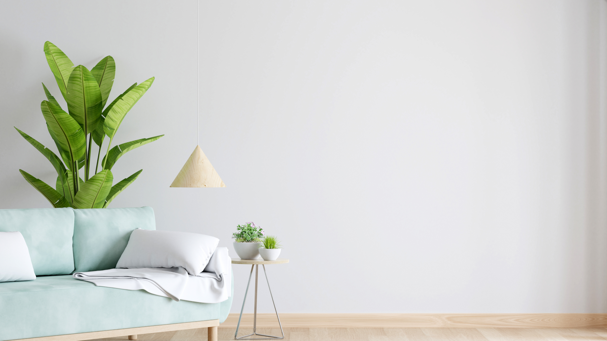

# 鳥羽商船の講義「画像処理」（2022）のチームR開発

チームRの開発物のソースコードを管理します。

プログラミング初心者／Python初学者が見ることを想定しているので、クラスや型アサーション等の機能は利用していません。

## 最終課題として実装しようとしているアイデア

部屋の写真を撮影すると、部屋に合った壁紙の色を提案してくれるシステムです。

部屋の写真から、HSVフィルタリング処理を行って色を検出したり、輪郭抽出で家具の形状を取得するなどによって、壁紙の色を提案します。

## 実行環境

- Python 3.10.4

## 入力

真正面から撮影した部屋の画像1枚（1920×1080 または 1280×720 / 3チャンネル）

### 例



[Image by wuttichai1983](https://www.freepik.com/free-photo/green-sofa-white-living-room-with-free-space_19703425.htm#query=living%20room&position=0&from_view=keyword)
on Freepik

## 出力

壁紙の色（RGB）

```
提案されたの壁紙の色: rgb(226, 232, 240)
```

## フローチャート

Coming soon
