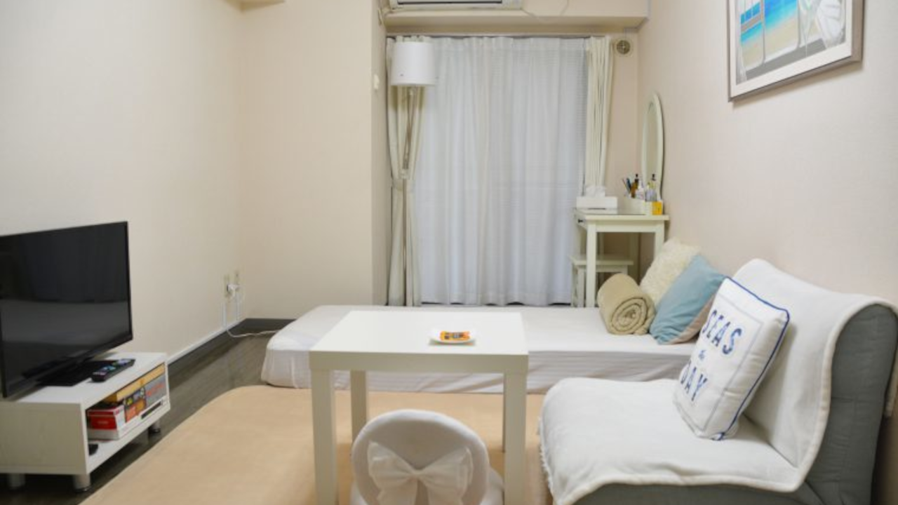
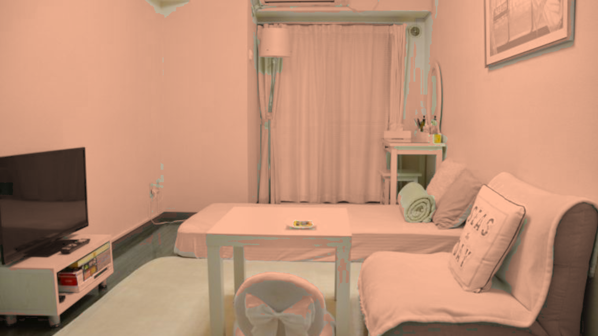

# 鳥羽商船の講義「画像処理」（2022）のチームR開発

チームRの開発物のソースコードを管理します。

プログラミング初心者／Python初学者が見ることを想定しているので、関数やクラス、型アサーション等の機能は利用していません。

## 最終課題として実装しようとしているアイデア

壁紙を検出し、壁紙の色を特定のテーマの色に変えて提示してくれるシステムです。
部屋の雰囲気を変えたいときに、このシステムを使用します。

## 実行環境

- Python 3.10.4

## 入力

真正面から撮影した部屋の画像1枚（1920×1080 または 1280×720 / 3チャンネル）

### 入力例

Theme: minimalist

## 出力

## フローチャート

